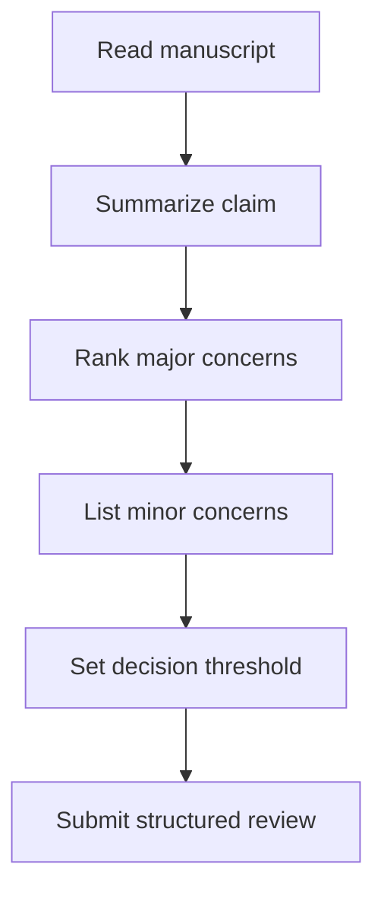

# Review Decision Flow Diagram

```mermaid
flowchart TD
  A[Read manuscript] --> B[Summarize claim]
  B --> C[Rank major concerns]
  C --> D[List minor concerns]
  D --> E[Set decision threshold]
  E --> F[Submit structured review]
```
